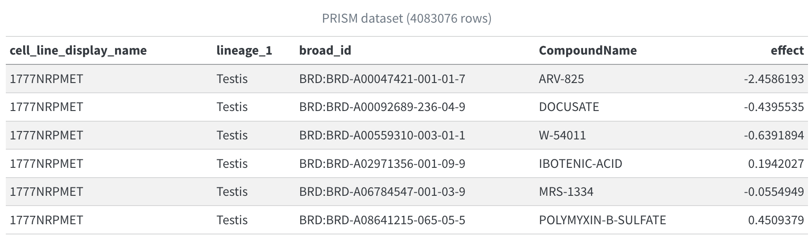
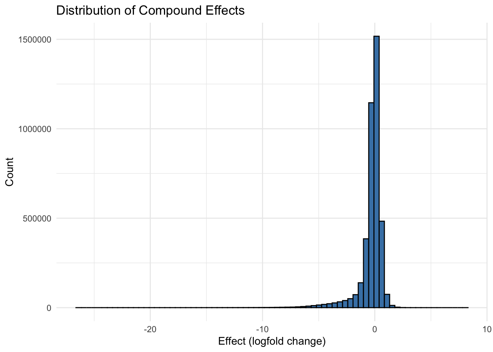

# Introduction 

-   Dataset
-   Research Question

---

## PRISM Dataset {.smaller}

Data downloaded from DepMap (Cancer Dependency Map) at the Broad Institute.


-   PRISM molecular barcoding method
-   6,562 compounds screened
-   915 cancer cell lines

---

## Research Question

**Which compounds are most effective across different cancer types?**   
<br> 

Motivation:
   
-   High-throughput data: applicable to cancer research
-   Discover the effect of existing drugs on cancer cells, including non-oncology drugs

--- 

# Methods

-   Data Overview
-   Key Variables
-   Exploratory Plots

--- 

## Data Overview {.smaller}

-   Original dataset: wide format with rows of cell lines and columns of compounds.
-   After data cleaning: long format with rows of unique cell line x compound combinations tested
-   4,083,076 observations: 6,562 compounds tested with 915 cell lines representing 29 cancer types



---

## Key variables {.smaller}

-   **Cancer Type** (`lineage_1`): The broadest lineage type for cell lines in the dataset
-   **Broad ID** (`broad_id`): The alphanumeric code assigned to each compound
-   **Compound Name** (`CompoundName`): The common name assigned to each compound
-   **log2FC** (`effect`): The indicator of interest: log2 fold-change of cell abundance in the treatment group relative to the control group treated with Dimethyl sulfoxide (DMSO)

$$ log_{2}\text{FC} = log_{2}(\frac{\text{treatment}}{\text{control}}) $$

**Interpretation**:

-   $log_{2}$FC \< 0: less cell abundance compared to DMSO (sensitivity to the compound)
-   $log_{2}$FC = 0: no effect compared to DMSO
-   $log_{2}$FC \> 0: more cell abundance compared to DMSO (rare)

---

## Exploratory Plots {.smaller}

:::: {.columns}

::: {.column width="50%"}

:::

::: {.column width="50%"}

:::

::::

Lung cancer is by far the most represented cancer type in the dataset, followed by lymphoid cancer.

The distribution of log2FC is slightly left skewed, with most values around 0.

---

# Results

-   Cancer types ranked by sensitivity
-   Top 20 most effective compounds overall
-   Effect of top 30 compounds on each cancer
-   Top compounds, filtering by cancer

---

### Cancer types ranked by sensitivity


---

### Compounds with highest effect


---

### Effect of top 30 compounds on each cancer

```{r}
#| echo: false
#| fig-width: 9
#| fig-height: 6
readRDS("plots/fig_4.rds")
```

---

### Top compounds, filtering by cancer

```{r}
#| echo: false
#| fig-width: 10
#| fig-height: 6
readRDS("plots/fig_5.rds")
```

---

# Conclusion

---

## Summary {.smaller}

-   Compounds that are highly effective across all cancers: VLX1570, Trabectedin, BEBT-908
-   Compounds that show strong effectiveness only for specific cancers are more informative because they likely reflect specific biological mechanisms. 
-   By looking at cancer-specific compound effects and comparing them with the global effects, we can identify which compounds are effective and selective for different cancer types.

<br>

Limitations:

-   Focused on the average effects across cell lines: masks variation in effect
-   Next step: Adding a measure of variability to identify which compounds are effective and consistent

---

# Thank you!

