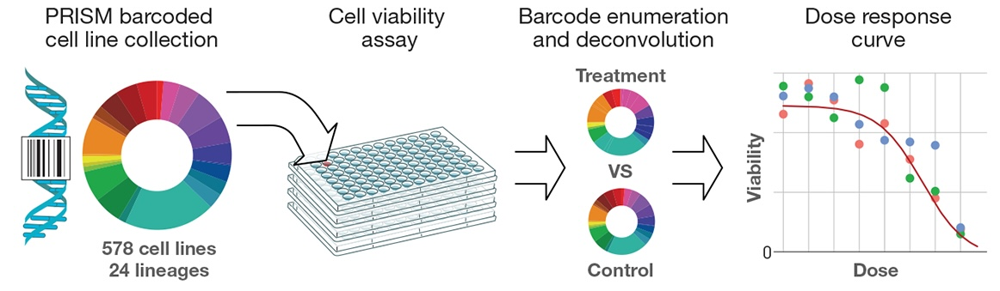
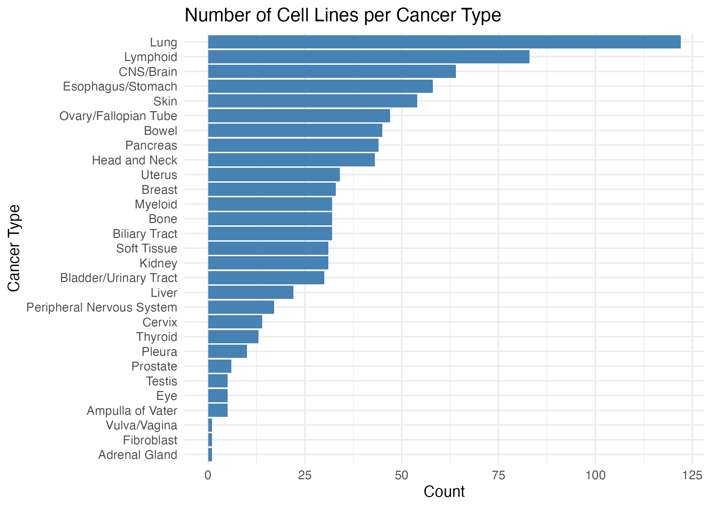
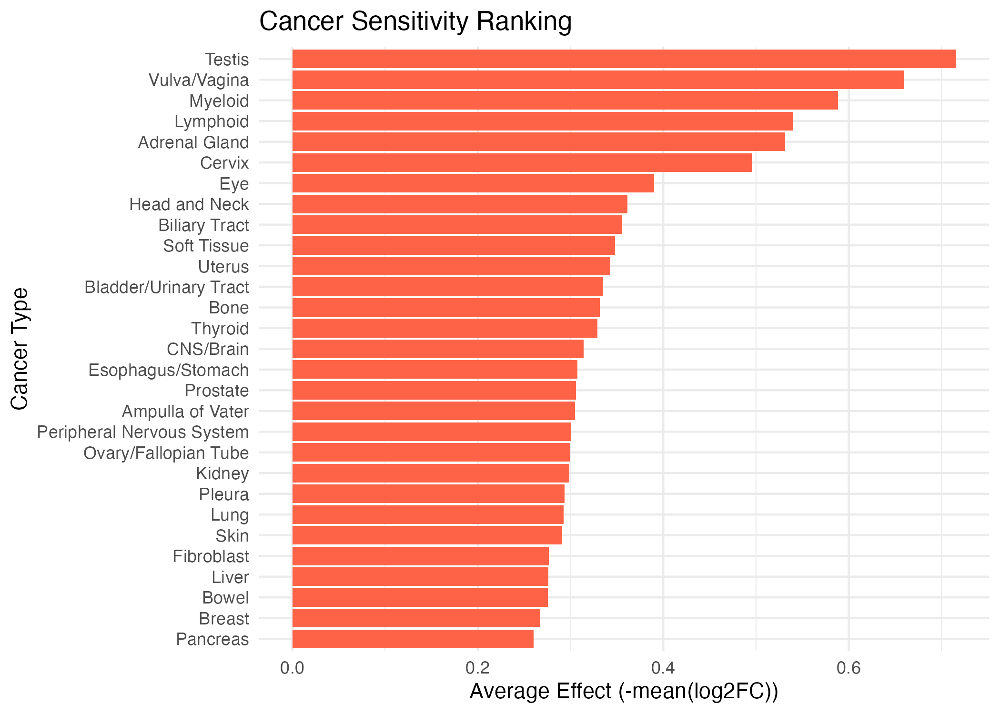
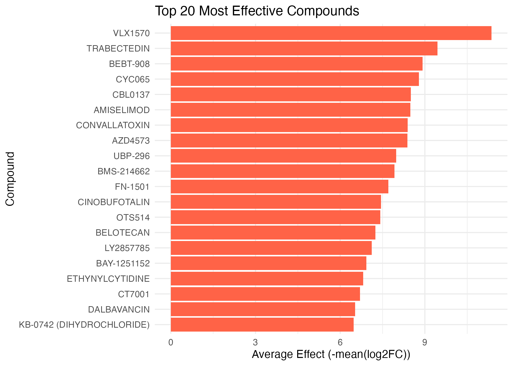

# Introduction

## PRISM Dataset

Data used for this project was DepMap PRISM data from the Broad Institute. The dataset comprises of 6,562 compounds screened at 2.5 uM on 915 cancer cell lines using the PRISM molecular barcoding method (Corsello et al., 2020). All cell lines are barcoded, pooled in groups of 25, and tested with compounds. After 5 days, the barcodes are recovered from the cell lines, and cell line viability is assessed by the abundance of each barcode after screening.

Compounds are screened in triplicate, and high-quality replicates are used. The data is normalized using ComBat for each compound plate-well combination to adjust for differences between testing across different batches.

{fig-align="center"}

## Research Question

The high-throughput nature of the DepMap PRISM dataset makes for a strong practical application in cancer research. It allows us to see how a large number of compounds affect diverse cancer cell lines. Researchers can discover the effect of existing drugs on cancer cells, including non-oncology drugs that can potentially be repurposed for cancer therapeutics.

The primary research question driving this analysis is: **Which compounds are most effective across different cancer types?** To answer this, I compared the average log2 fold-change (log2FC) for each compound across different cancer types.

# Methods

Data used for this project was downloaded from the [DepMap portal](https://depmap.org/portal/data_page/?tab=customDownloads). Two datasets were downloaded: The **PRISM Repurposing Primary** dataset, subsetted by per compound sample, and the **PortalCompounds** dataset, which provides compound metadata.

To prepare the dataset for analysis, I pivoted the dataset from wide to long format to obtain all unique cancer-compound combinations. Rows with NAs were removed, as these represented cancer-compound combinations that were not tested. I added the compound names by merging with the PortalCompounds dataset.

The resulting dataset has 4,083,076 observations of 6,562 compounds tested with 915 cell lines representing 29 cancer types.

There are three levels of cell line classification, from lineage 1 to lineage 3. Lineage 1 is the broadest categorization, and lineage 3 is the most specific categorization. For better interpretability in this analysis, cancer types are defined by the lineage 1 classification.

The indicator of interest is log2 fold-change in cell abundance for each cell line in the treatment group relative to the control group treated with Dimethyl sulfoxide (DMSO). The treatment was compared to the control from the same cell line on the same detection plate.

$$ log_{2}\text{FC} = log_{2}(\frac{\text{treatment}}{\text{control}}) $$

**Interpretation**:

-   $log_{2}$FC \< 0: less cell abundance compared to DMSO (sensitivity to the compound)

-   $log_{2}$FC = 0: no effect compared to DMSO

-   $log_{2}$FC \> 0: more cell abundance compared to DMSO (rare)

{fig-align="center"}

The distribution of cell lines per cancer type show that certain cancers are more represented in the dataset (Fig. 1). Lung cancer has the highest number of cell lines by far, followed by Lymphoid and CNS/Brain cancers. This can be partially explained by the fact that these cancers have more distinct subtypes in the dataset, as described in the "About the Data" page. Thus, some cancer types are more densely sampled, which we should consider when comparing average effects of compounds.

# Results

To continue our analysis, we now examine the sensitivity of cancer types and rank compounds by their overall efficacy.

### Ranking of cancer types by average sensitivity
{fig-align="center"}

Cancer types ranked by average sensitivity shows which cancers were most/least affected by compounds on average (Fig. 2). This provides a visualization of which cancers are generally more sensitive to drugs and which are more resistant to drugs. Some of the most sensitive cancers include cancer in the Testis, Vulva/Vagina and Myeloid, indicating that these cancer cell lines were most susceptible to reduction in viability. In contrast, some of the most drug resistant cancers include cancer in the Liver, Bowel, Breast, and Pancreas.

### Compounds with highest effect

{fig-align="center"}

VLX1570 is the most effective compound in this study when comparing the mean log2FC across all cell lines (Fig. 3). This compound has been shown to be effective in killing lung cancer cells and multiple myeloma (cancer in bone plasma) and inhibiting growth of new cells (Wang et al., 2021). This observation is consistent with what we see in our dataset, as lung cancer is by far the most representative cell line type in the dataset.

Despite its effectiveness in the study, Phase I clinical trials for VLX1570 in patients with multiple myeloma were stopped due to dose-limiting toxicity issues. Other top compounds include Trabectedin, a chemotherapy drug used for soft-tissue sarcoma and ovarian cancer; BEBT-908, a relatively novel drug used for lymphoma; and CYC065, a drug that is being studied for solid tumors and lymphoma.

## Top 30 most effective compounds on each cancer type
```{r}
#| echo: false
#| fig-cap: "Fig. 4"
readRDS("plots/fig_4.rds")
```


In general, the compounds that are most effective overall have a very strong effect across most cancer types. However, the most sensitive cancer types are not necessarily more responsive to the top compounds compared to the most resistant cancer types (Fig. 4). We can further investigate compounds that are effective for specific cancer types.

Certain compounds vary in efficacy based on cancer type. For example, the efficacy of VLX1570 is relatively less effective vulva/vagina cancer compared to other cancers, whereas Belotecan has a strong effect on vulva/vagina cancer but is less effective other cancers. This suggests that even though certain compounds are more effective globally, they still have different effects based on cancer type.

Because the heatmap orders cancer types by sensitivity, we can also notice that some cancers were ranked as more resistant/sensitive with the top 30 compounds, but were not among the most resistant/sensitive overall (Fig. 2), such as eye, prostate, and liver cancer. These inconsistencies suggest that sensitivity of a cancer type may be dependent on compounds rather than overall sensitivity of the cancer.

I decided to further investigate the top compounds for each cancer, with a focus on these specific cancer types as well as those with variable effects among compounds, as they are likely to be different from the overall top 30 compounds.

## Top compounds, filtering by cancer
```{r}
#| echo: false
#| fig-cap: "Fig. 5"
readRDS("plots/fig_5.rds")
```


By filtering for the top compounds within each cancer type, we can identify which compounds are most effective for each specific cancer type (Fig. 5). For eye and prostate cancer, there are several top compounds not present within the overall top 30, including Elacestrant, CB-5083, and Verdinexor.

For adrenal gland cancer, Avitinib is one of the most effective compounds even though it is less effective for other cancers. Similarly, the top compounds for vulva/vagina cancer is quite different: PIM-447 is the fourth most effective compound, but is not in the top 30 overall.

# Summary

There are several compounds that are highly effective across all cancers in the PRISM dataset such as VLX1570, Trabectedin, BEBT-908. However, broad efficacy does not necessarily mean that these drugs will be useful in cancer therapeutics due to many of them having issues with toxicity or lack of selectivity. Compounds that show strong effectiveness only for specific cancers are more informative because they likely reflect specific biological mechanisms. By looking at cancer-specific compound effects and comparing them with the global effects, we can identify which compounds are effective and selective for different cancer types. These analyses can be a starting point for digging deeper into the biological mechanisms for why different cancer types respond well to specific compounds.

Because these analyses are focused on the average effects across cell lines, we cannot see the variability in their effect. Next steps in the analysis would be to evaluate the variance combined with the magnitude of effect across different cancers. Adding a measure of variability would allow us to identify which compounds are both effective and produce consistent results within cancer types, making the results more robust and applicable to cancer therapeutics.

---

### References

Corsello SM, Nagari RT, Spangler RD, et al. Discovering the anti-cancer potential of non-oncology drugs by systematic viability profiling. Nat Cancer. 2020;1(2):235-248. doi:10.1038/s43018-019-0018-6

DepMap, Broad (2026). DepMap Public 26Q1. Dataset. [depmap.org](https://depmap.org/)

Arafeh, R., Shibue, T., Dempster, J.M. *et al.* The present and future of the Cancer Dependency Map. *Nat Rev Cancer* **25**, 59-73 (2025). https://doi.org/10.1038/s41568-024-00763-x

Wang J, Du T, Lu Y, et al. VLX1570 regulates the proliferation and apoptosis of human lung cancer cells through modulating ER stress and the AKT pathway. J Cell Mol Med. 2022;26(1):108-122. doi:10.1111/jcmm.17053
